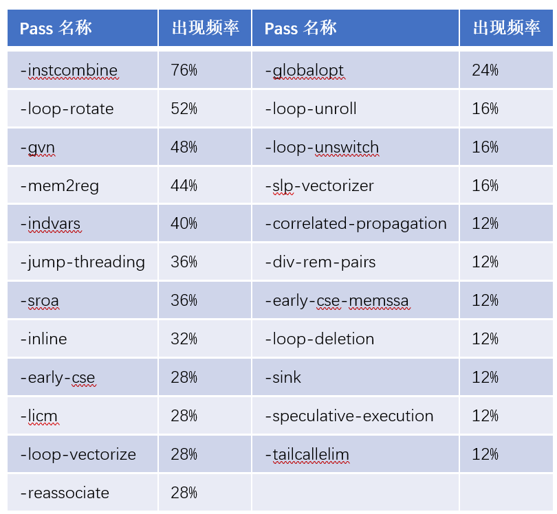

# llvmtuner使用说明


## Installation
以下安装流程在Ubuntu20下测试通过

### 1. 安装llvmtuner
首先安装python环境
>conda create -n llvmtuner python=3.9.9
>conda activate llvmtuner

首先下载代码
>git clone https://github.com/gloaming2dawn/LLVMTuner.git

cd进入主目录，安装llvmtuner：
```
pip install -r requirements.txt
pip install -e .
```
安装后将生成clangopt/clangxxopt命令行工具和可导入的llvmtuner库

### 2. 安装LLVM 17.0.6及自定义pass _**FuncNames**_
使用提供的自动脚本安装LLVM17.0.6，默认安装目录为~/llvm17.0.6
>./install_llvm.sh

完成后将对应二进制路径添加至环境变量：
>export PATH=~/llvm17.0.6/bin/:$PATH

测试LLVM安装是否成功
>clang --version

安装 _**FuncNames**_
```
export LLVM_DIR=~/llvm17.0.6
cd FuncNames
mkdir build
cd build
cmake -DLT_LLVM_INSTALL_DIR=$LLVM_DIR ..
make
```

### 3. 下载FlameGraph
```
git clone https://github.com/brendangregg/FlameGraph.git
```

## 功能详细说明：如何对一个新程序进行调优
### 1. 自动获取热点文件
首先我们考虑真实程序往往有较多源文件，我们需要自动识别热点文件的功能。注意为自动获取热点文件，用户需在目标平台具有root权限（因为perf收集profile数据需要root权限），并提前设置无需输入密码即可使用sudo。可在目标平台通过"sudo visudo"来编辑 sudoers 文件，在文件末尾添加
> username ALL=(ALL) NOPASSWD: ALL #修改username为对应用户名

```python
import llvmtuner
from llvmtuner.utils import gen_hotfiles

hotfiles, hotfiles_details = gen_hotfiles(build_cmd, build_dir, tmp_dir, run_cmd, run_dir, binary) # 用户提供 build_cmd, build_dir, run_cmd, run_dir, binary
print(hotfiles,hotfiles_details)
```

### 2. 将调优问题定义为黑盒函数
自动得到热点文件后，用户可将phase-ordering问题定义为黑盒函数，并且在给黑盒函数确定热点文件后，该函数每次接受新的编译配置时，只会编译热点文件。

考虑到真实调优场景要求我们使用交叉编译，即编译在多核高性能x86平台，而运行程序在目标平台（如嵌入式开发板），我们也添加了相应支持。

总的来说用户只需提供其正常编译和运行所需命令和对应执行路径，即可实现自动调优。唯一需要的工作是在提供build_cmd时显示地将编译器名称由clang/clang++替换为clangopt/clangxxopt，比如`make CC=clangopt`。

同时我们提供了pass自动筛选功能，以方便用户分析哪些编译选项（pass）对程序重要。

```python
import llvmtuner
from llvmtuner import searchspace
from llvmtuner.function_wrap import Function_wrap
from llvmtuner.baselines.random import random_optimizer # 提供三种算法random,nevergrad及BO
from fabric import Connection

passes = searchspace.default_space()[0]
ssh_connection = Connection(host="xxx.xxx.xxx") #用户提供基于fabric的ssh连接，本地编译并运行则无需提供

fun = Function_wrap(
                    build_cmd=build_cmd, #编译命令，用户提供，注意需将编译器名称由clang/clang++替换为clangopt/clangxxopt
                    build_dir=build_dir, #编译路径，用户提供
                    tmp_dir=tmp_dir, #数据存放目录，用户定义
                    run_cmd=run_cmd, #运行命令，用户提供
                    run_dir=run_dir, #运行路径，用户提供
                    binary=binary, #编译后的二进制文件路径，用户提供
                    ssh_connection=ssh_connection, #ssh连接
                    )
fun.build('default<O3>') # 首先不考虑热点文件在O3下编译，确保非热点文件均在O3下已编译，防止后续编译出错
fun.hotfiles = hotfiles # 然后加入热点文件，此后函数每次接受新的编译配置时，只会编译热点文件

'''
# 假定用户希望自己提供一个自定义的测量函数，而不是使用我们默认提供的测量函数（基于运行命令run_cmd和运行文件夹run_dir，来测量运行时间），可使用以下方式
fun = Function_wrap(build_cmd, #编译命令，用户提供
                    build_dir, #编译路径，用户提供
                    tmp_dir, #数据存放目录，用户定义
                    run_cmd, #运行命令，用户提供
                    run_dir, #运行路径，用户提供
                    hotfiles, #热点文件，用户提供
                    ssh_connection, #ssh连接
                    run_and_eval_fun, #用户提供的测量函数
                    ) #
'''
# cost = fun(config) # 可选，测量某个编译配置的性能，例如config可以为'default<O3>'


optimizer=random_optimizer(fun=fun, passes=passes, budget=1000) # 使用random搜索算法，预算1000次
best_cfg, best_cost = optimizer.minimize() # 自动调优，并获取最优配置及对应运行时间，同时所有中间结果均存放于tmp_dir
fun.build(best_cfg) # 再次使用最优配置编译生成二进制
# fun.reduce_pass(best_cfg) # 可选，使用reduce_pass来筛选出真正对性能有提升的pass
```

## 快速测试
### 1. CBench上测试：本机环境编译并运行程序
下载和安装cBench_V1.1，我们已经提供好python脚本以自动下载和安装cBench，以下命令将cBench_V1.1安装在用户主目录下
```
cd example
python download_cbenchdatasets.py
```

执行以下命令赋予cBench执行权限
>sudo chmod -R 777 ~/cBench_V1.1

在example文件夹下，执行以下命令来使用我们的贝叶斯优化方法调优特定benchmark，对应结果将保存在~/local_result_llvmtuner/cBench/目录下
>python run_cBench.py --method=BO --budget=300 --benchmark=telecom_adpcm_c

这里我们提供三种可选method：random, nevergrad, BO
benchmark同样可以相应替换为security_sha, telecom_gsm等，更多可供调优的benchmark可参阅run_cBench.py文件。


### 2. 在cBench上进行交叉编译测试
真实调优场景要求我们使用交叉编译，即编译在多核高性能x86平台，而运行程序在目标平台（如嵌入式开发板）。我们提供了run_cBench_ssh.py在我们的环境下实现了交叉编译调优。用户应根据实际情况修改该文件，具体所需修改如下（即修改对应平台的交叉编译命令，运行文件夹，ssh连接等）：

```python
cross_flags='--target=aarch64-linux-gnu --sysroot=/home/jiayu/gcc-4.8.5-aarch64/install/aarch64-unknown-linux-gnu/sysroot/ --gcc-toolchain=/home/jiayu/gcc-4.8.5-aarch64/install' #用户应替换为对应平台下的交叉编译工具链
build_dir = os.path.expanduser(f'~/cBench_V1.1/{args.benchmark}/src_work/')
build_cmd = f'make ZCC=clangopt LDCC=clangopt CCC_OPTS="{cross_flags}" LD_OPTS="{cross_flags}" -C {build_dir}'#用户应替换为相应的交叉编译命令

tmp_dir = os.path.join(os.path.expanduser('~/result_llvmtuner_17_test1/cBench/'), args.benchmark, args.method)
binary = os.path.join(build_dir, 'a.out')

ssh_connection=Connection(host=f'nvidia@TX2-{args.device}.local') #用户应替换为相应的ssh连接，支持多次跳转，参阅fabric的API
run_dir = '/home/nvidia/cBench_V1.1/{}/src_work/'.format(args.benchmark) #用户应替换为相应的运行路径
run_cmd = ben2cmd[args.benchmark]
```

### 3. SPEC CPU 2017测试
SPEC CPU 2017有版权限制，用户需自行购买并下载SPEC CPU 2017到主目录下，参考(https://www.spec.org/cpu2017/Docs/install-guide-unix.html)进行安装，并更新到最新版本。

同时由于SPEC CPU 2017和常见benchmark不同，其提供了runcpu命令行工具而非编译脚本供用户使用。我们需要根据实际平台系统修改一个cfg文件置于config/目录下，这里我们在example文件夹中提供了my-clang-linux-x86.cfg配置文件支持LLVM编译器、linux系统、x86平台，方便用户本地测试。用户需复制到config/目录下。
>cp my-clang-linux-x86.cfg ~/cpu2017/config/

我们同时提供了脚本来生成运行目录和运行脚本，见example文件夹下的gen_rundir_spec2017.py，执行以下命令将在主目录下生成spec2017_run目录，以519.lbm_r为例，其运行目录为~/spec2017_run/519.lbm_r/，运行脚本为run_519.lbm_r.sh。
>python gen_rundir_spec2017.py

用户可以运行以下命令在本机环境下自动调优SPEC CPU 2017：
>python run_SPEC.py --method=random --budget=10 --benchmark=519.lbm_r

对于SPEC CPU 2017在交叉编译情形下的测试，用户需根据实际情况，编写对应cfg文件，我们提供了用于在x86平台交叉编译aarch64的配置文件为见my-clang-linux-cross_x862aarch64.cfg。用户还需将对应生成的spec2017_run目录传输到目标执行平台。


### 4. 实验结果
性能测试平台：Jetson-TX2 (4核 Arm cortex-a57, 2.0GHz, 8G LPDDR4, Linux Kernel 4.4.15)

交叉编译及算法运行平台：Intel Xeon Gold 5218R CPU

编译器：LLVM 17.0.6

基准程序集：cBench及SPEC CPU 2017

对比方法：为了体现我们的搜索方法的效率，我们选择了随机搜索random、nevergrad框架默认搜索方法作为对比。对于cBench，这两种方法给定的搜索预算是1000次；而我们自己的搜索方法只给定500次的搜索预算。对于SPEC，由于其运行代价高昂，所有方法均只运行300次。

cbench实验结果可见下图,我们的算法在仅使用了1/2的搜索预算的情况下仍然取得了超越其他算法的性能。


SPEC实验结果可见下图,我们的算法整体仍然取得最优结果


Pass分析：我们的搜索框架同时还提供了对搜索到的优化序列进行最小化的功能，用于分析到底哪些pass对程序的影响较大。我们统计了对于cbench不同pass出现在最优序列中的频率，频率超过10%的pass在下表中可见，观察到的趋势是大部分高频pass都与冗余指令削减相关，此外循环优化相关pass也占很大比例。




